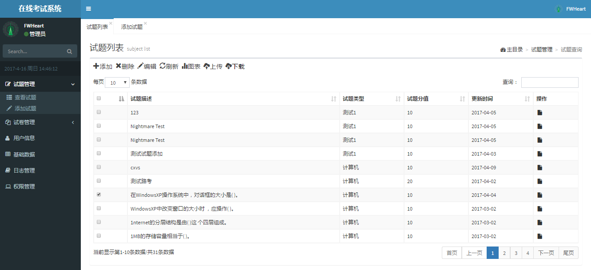
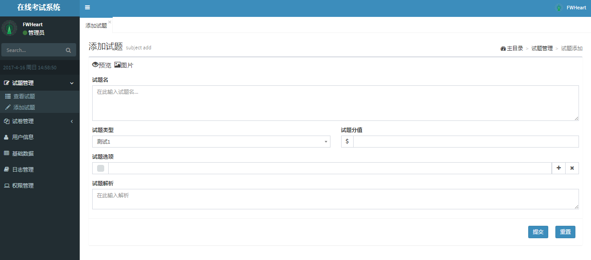
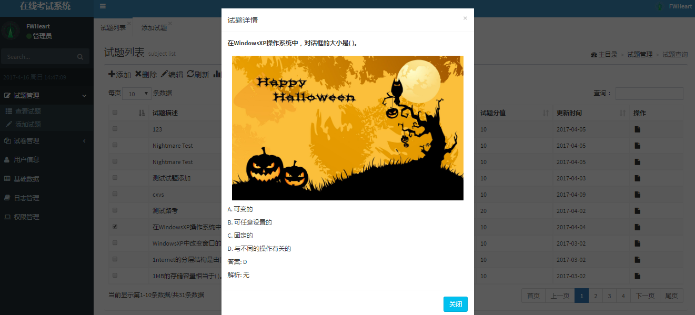
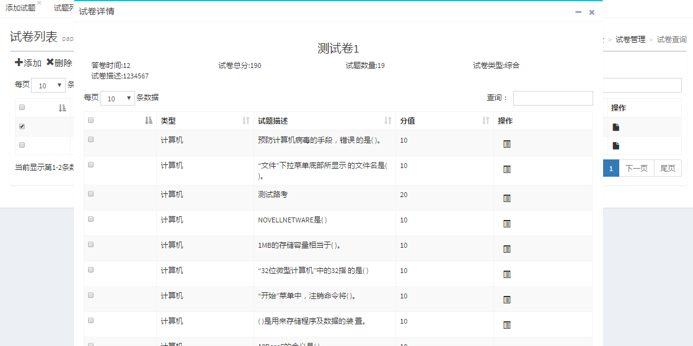
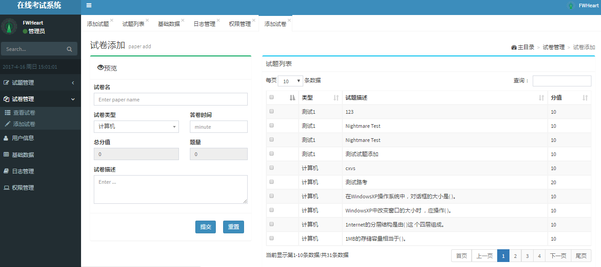
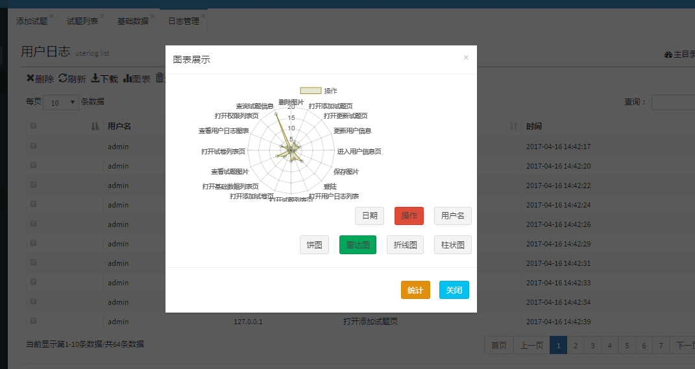
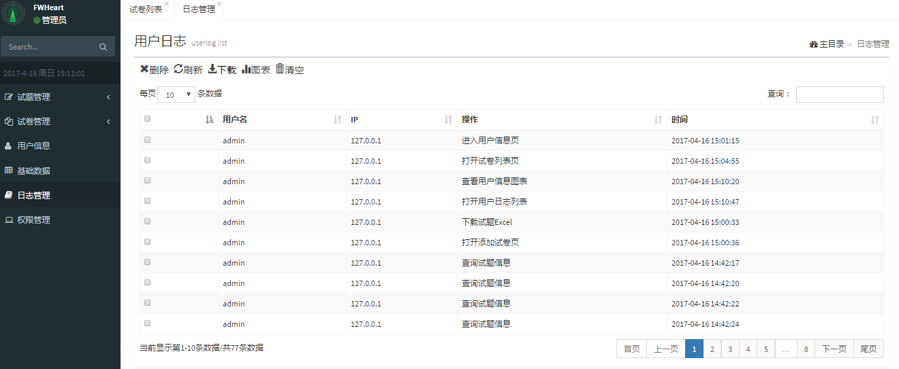
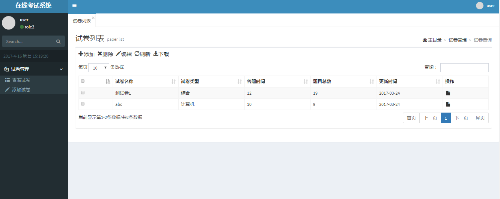
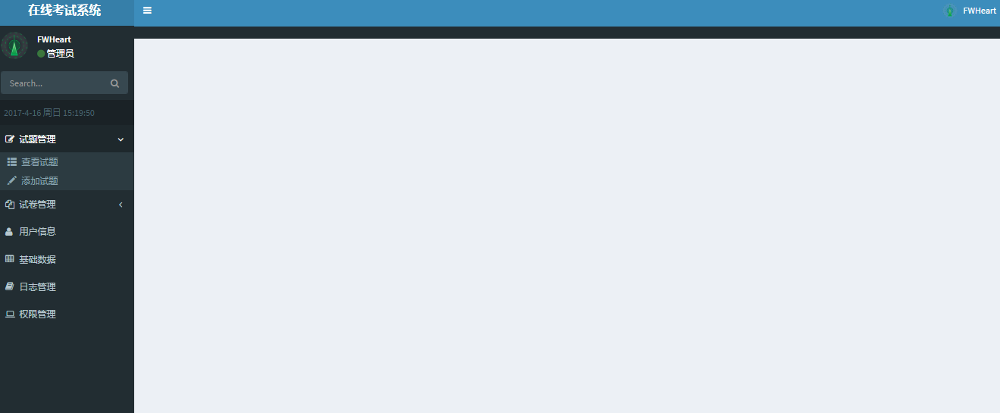

# OnlineTestSystem-SpringBoot
OnlineTestSystem-SpringBoot是对去年写的OnlineTestSystem的用SpringBoot重写的版本，目的在于学习新的框架、知识。实现的功能:基本数据的增删改查、基础数据类型的更改、Excel的导入导出、图表数据展示、权限管理、用户操作记录。
后台:SpringBoot + SpringMVC + Mybatis
前台:AdminLTE

## Screenshot
试题列表

试题添加

试题信息

试卷详情

添加试卷

图表展示

用户操作列表

用户权限登录

管理员权限登录


## 目录结构
主要目录结构
```txt
OnlineTestSystem-SpringBoot/
   |
   ├──target/                    * 生成jar,class目录
   |
   ├──screenshot/                * 屏幕截图
   |
   ├──src/main                   * 源文件目录
   │   │
   │   │──java                   * 后端java代码
   │   │
   │   └──resources              * 资源文件夹
   │     │
   │     └──cn/edu/tjut/ots/dao  * mybatis的mapper文件
   │     │
   │     └──static               * 静态资源文件
   │     │
   │     └──templates            * thymeleaf模板文件夹
   │     │
   │     └──application.yml      * SpringBoot配置文件
   │     │
   │     └──mybatis.xml          * Mybatis配置文件
   │     │
   │     └──log4j.properties     * log4j配置文件
   │     │
   │     └──userLog_map.properties * 用户操作对应属性文件
   │
   │──pom.xml                    * maven工程pom文件
   │
   │──readme.md                  * ReadMe
   │
   └──其他                       * IDEA生成文件
```

## 坑和经验
